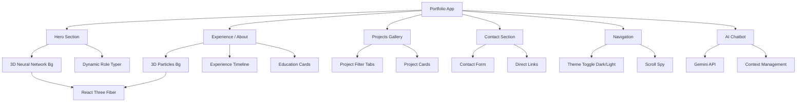
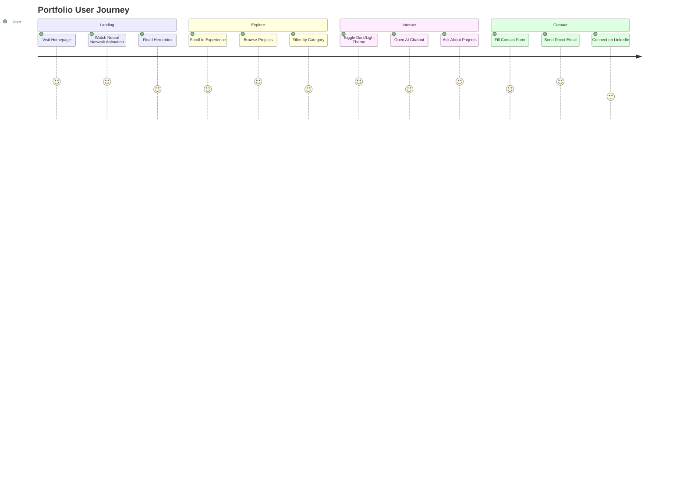
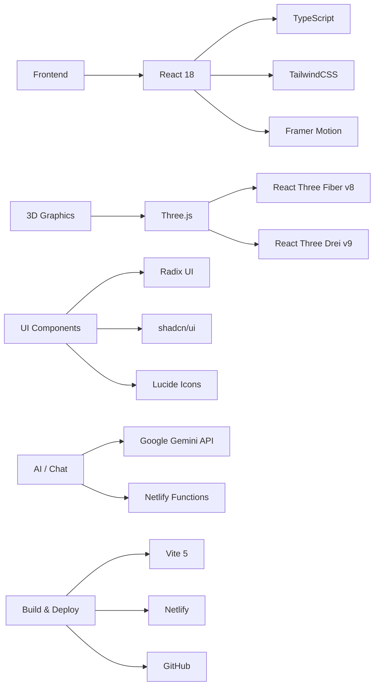

<div align="center">

# Srija Vuppala — Portfolio v2.0

</div>

[](https://react.dev/)
[](https://www.typescriptlang.org/)
[](https://vitejs.dev/)
[](https://tailwindcss.com/)
[](https://srijavuppala.com)
[](LICENSE)

A modern, interactive portfolio website built with React and TypeScript — featuring a 3D neural network background, AI-powered chat assistant, dark/light theme toggle, and smooth Framer Motion animations.

---

<div align="center">
  <h3>🌐 Live at <strong><a href="https://srijavuppala.com">srijavuppala.com</a></strong></h3>
  <p><em>Full-Stack Engineer · AI · Cloud — built for performance and clarity</em></p>
</div>

---

## Architecture Overview



## User Experience Flow



## Key Features

### Core Functionality
- **Dark / Light Theme** — toggle with persistent localStorage preference
- **3D Neural Network Background** — interactive Three.js particle constellation in the Hero
- **AI Chat Assistant** — floating chatbot powered by Google Gemini API
- **Project Gallery** — filterable by category (AI/ML, Hackathon, Research, Hardware, Web Apps)
- **Contact Form** — direct email delivery via Web3Forms
- **Scroll Spy Navigation** — active tab updates as you scroll through sections

### Technical Features
- **React 18 + Vite 5** — fast HMR and optimised production builds
- **TypeScript** — fully typed components and hooks
- **Framer Motion** — smooth entrance animations and layout transitions
- **React Three Fiber v8** — lazily loaded 3D backgrounds (zero impact on TTI)
- **Radix UI + shadcn/ui** — accessible, unstyled component primitives
- **Netlify Functions** — serverless backend for chat API proxying
- **SEO + OG Tags** — structured JSON-LD, Open Graph, Twitter Card metadata

## Tech Stack



### Key Dependencies

| Package | Purpose |
|---|---|
| `react` + `react-dom` | UI framework |
| `framer-motion` | Animations & transitions |
| `@react-three/fiber` | React renderer for Three.js |
| `@react-three/drei` | Three.js helpers & utilities |
| `three` | 3D graphics engine |
| `@google/generative-ai` | Gemini AI for chatbot |
| `@tanstack/react-query` | Async state management |
| `react-hook-form` + `zod` | Form handling & validation |
| `tailwindcss` | Utility-first styling |

---

## Features Deep Dive

### AI Chat Assistant
- Floating chatbot powered by Google Gemini API
- Context-aware responses about projects, experience, and skills
- Smooth open/close animations with message history
- Serverless backend via Netlify Functions for API key security

### 3D Neural Network Background
- ECS-inspired architecture with pre-allocated Float32Array buffers
- O(n²) pairwise particle connection system (~2,300 pairs max)
- Mouse parallax and slow rotation via `useFrame`
- Adaptive particle count (32 mobile / 68 desktop)
- Lazily loaded — zero impact on initial page load

### Theme System
- **Light**: warm cream `#f5f0e8` background with dark teal accents
- **Dark**: near-black `#0a0a0a` background with white text
- CSS custom properties — all components respond instantly
- Preference persisted to `localStorage`

### Projects Gallery
- 15+ projects across AI/ML, Research, Hardware, Hackathon, and Web Apps
- Filter tabs with smooth layout transitions
- Featured badges, category labels, GitHub & Devpost links
- Winner badges for hackathon victories

## Project Structure

```
src/
├── components/
│   ├── Hero.tsx                  # Landing with neural network bg
│   ├── Experience.tsx            # Timeline + education cards
│   ├── Projects.tsx              # Filterable project gallery
│   ├── Contact.tsx               # Contact form + links
│   ├── Navigation.tsx            # Scroll-spy nav + theme toggle
│   ├── Chatbot.tsx               # Floating AI assistant
│   ├── DynamicRoles.tsx          # Animated role typewriter
│   ├── three/
│   │   ├── NeuralNetworkBg.tsx   # Hero 3D constellation
│   │   └── ParticlesBg.tsx       # Section floating dots
│   └── ui/                       # shadcn/ui primitives
├── hooks/
│   ├── useTheme.tsx              # Dark/light theme hook
│   └── use-mobile.tsx
└── index.css                     # CSS custom properties (themes)
netlify/
└── functions/
    └── chat.js                   # Serverless Gemini proxy
```

## Getting Started

```bash
# Install dependencies
npm install

# Start dev server (http://localhost:8080)
npm run dev

# Production build
npm run build

# Preview production build
npm run preview
```

### Environment Variables

Create a `.env` file at the project root:

```env
VITE_GEMINI_API_KEY=your_gemini_api_key_here
```

## Deployment

The portfolio is deployed at **[srijavuppala.com](https://srijavuppala.com)** via Netlify with continuous deployment from GitHub.

### Netlify Configuration

```toml
[build]
  command = "npm run build"
  publish = "dist"
  functions = "netlify/functions"

[build.environment]
  NODE_VERSION = "20"

[[redirects]]
  from = "/*"
  to = "/index.html"
  status = 200
```

### Deploy via CLI

```bash
npx netlify deploy --prod
```

## Browser Support

| Browser | Support |
|---|---|
| Chrome | ✅ Recommended |
| Firefox | ✅ Full support |
| Safari | ✅ Full support |
| Edge | ✅ Full support |

## Performance Highlights

- **Lazy-loaded 3D** — Three.js chunks load after initial paint
- **Code-split bundles** — `NeuralNetworkBg` and `ParticlesBg` are separate async chunks
- **Pre-allocated buffers** — zero GC pressure in the Three.js animation loop
- **Adaptive DPR** — canvas clamped to `[1, 1.5]` to limit GPU load on retina displays
- **Optimised fonts** — `Space Grotesk` + `Outfit` via Google Fonts with `display=swap`

---

**Built with React + Vite** | **Powered by Gemini AI** | **Deployed at [srijavuppala.com](https://srijavuppala.com)**
